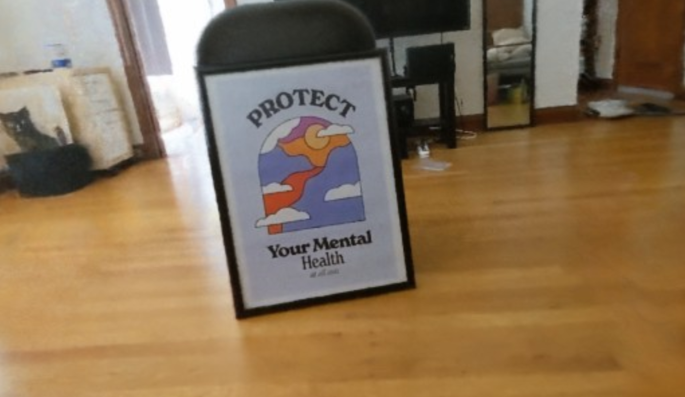
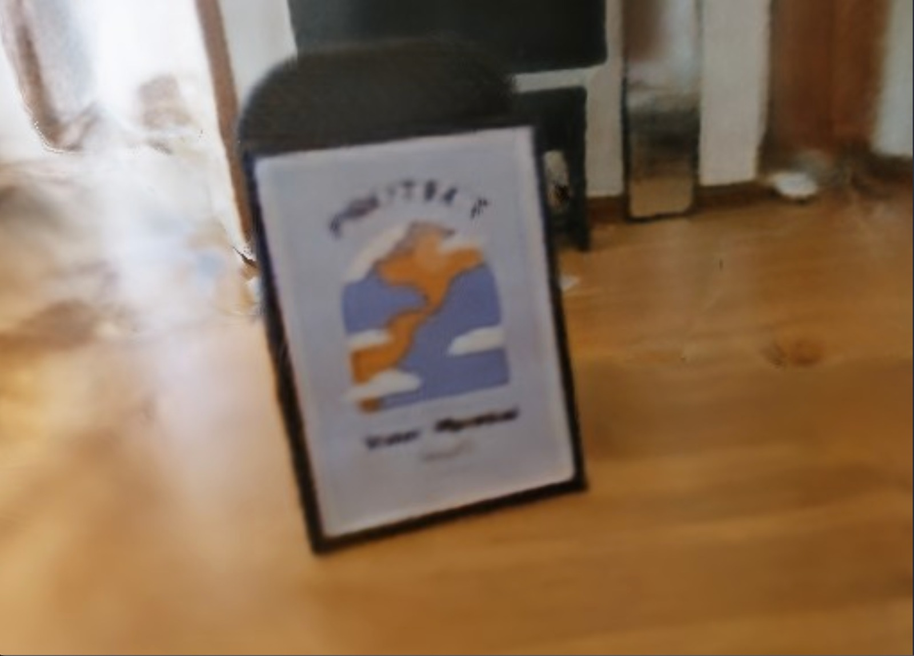
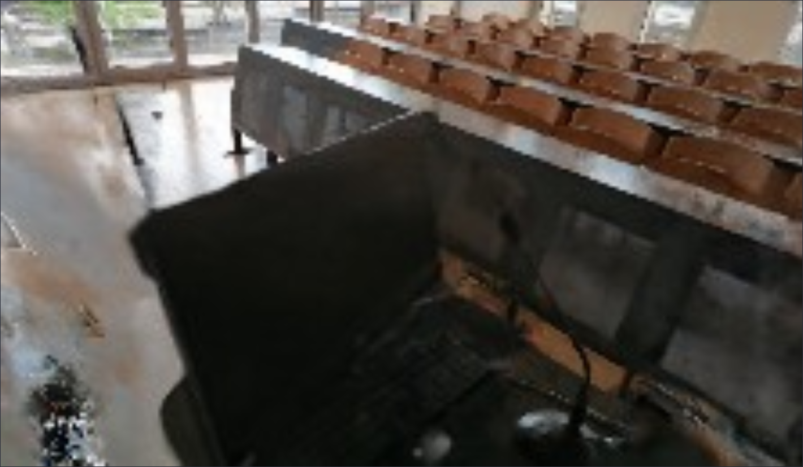
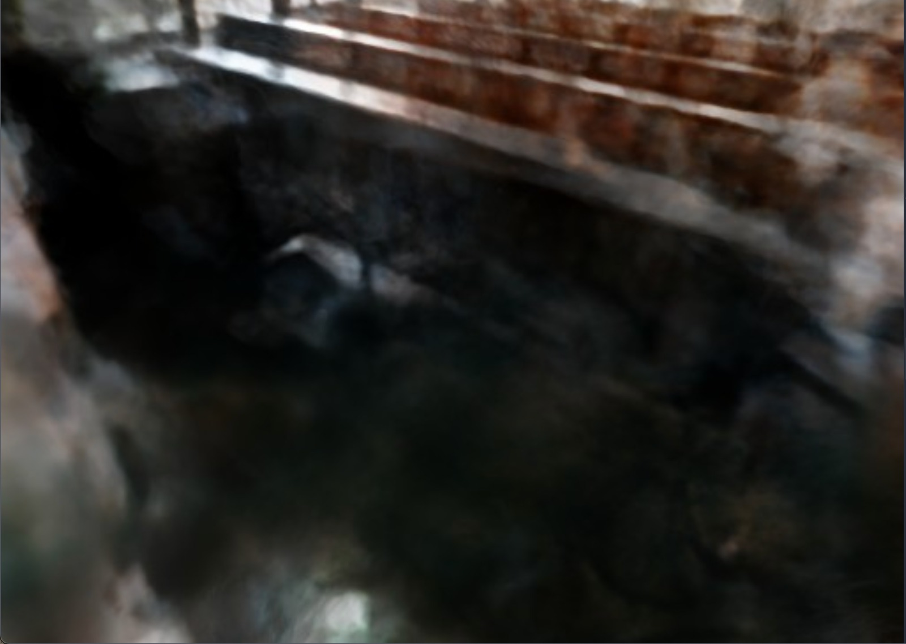

# Computer Vision - Virtual View Reconstruction

## Table of Contents
1. [Project Overview](#1-project-overview)
2. [Development Tools](#2-development-tools)
3. [Visual Journey](#3-visual-journey)
4. [Demo](#4-demo)
5. [Bibliography](#5-bibliography)
6. [Authors](#6-authors)

## 1. Project Overview

This project was developed for submission in **Computer Vision** course at **[University of Trento](https://www.unitn.it/en)**.

The main goal was to reconstruct virtual 3D models of objects or scenes from a set of 2D images that can be explored from different angles.

The focus centered on analyzing and understanding two state-of-the-art technologies:
- Neural Radiance Field (NeRF)
- Neural Implicit Surfaces (NeuS)

The efficiency of these technologies was enhanced through the utilization of GPU acceleration with the help of the tiny-cuda-nn repository, leveraging fully-fused Multilayer Perceptron (MLP) and Multiresolution Hash Encoding techniques.

To address this challenge, frameworks such as [Nerfstudio](https://docs.nerf.studio/) and [SDFStudio](https://autonomousvision.github.io/sdfstudio/) were employed. Three self-trained NeRF models were ported to [Unreal Engine](https://www.unrealengine.com/en-US) and visualized using the [Volinga Renderer](https://volinga.ai/) plugin.

Finally, the performance of these cutting-edge technologies was evaluated using key metrics:
- Peak Signal-to-Noise Ratio (PSNR)
- Structural Similarity Index Measure (SSIM)
- Learned Perceptual Image Patch Similarity (LPIPS)

## 2. Development Tools

- **Platform**: Unreal Engine 5.3
- **Plugins**:
    - **[Volinga Renderer](https://volinga.ai/)**: developed by Volinga, this plugin enables the importation of Radiance Field-based models into Unreal Engine
- **Frameworks**:
    - **[Nerfstudio](https://docs.nerf.studio/)**: a modular framework designed for NeRF development. It seamlessly combines a variety of NeRF variants into a user-friendly and easy-to-use environment
    - **[SDFStudio](https://autonomousvision.github.io/sdfstudio/)**: serves as a modular framework for NeuS technologies, built on top of  Nerfstudio

## 3. Visual Journey

The NeRF and NeuS models below were trained based on images from two different environments, the evaluation metrics of which can be found at the end of this section.

| NeRF model                            | NeuS model                            |
|---------------------------------------|---------------------------------------|
|    | 

 |
| | 

 |

### Evaluation Metrics

|                  | PSNR ↑ | SSIM ↑ | LPIPS ↓ |
|------------------|--------|--------|---------|
| NeRF (poster)    | 20.441 | 0.828  | 0.280   |
| NeuS (poster)    | 17.457 | 0.817  | 0.359   |
| NeRF (classroom) | 19.003 | 0.681  | 0.322   |
| NeuS (classroom) | 12.570 | 0.596  | 0.536   |

## 4. Demo

The project is located under the _Unreal/VirtualView/_ folder, excluding both the plugin and assets. The plugin can be downloaded [here](https://volinga.ai/) after registration and must be installed manually. Furthermore, the assets are available [here](https://drive.google.com/drive/folders/1AQVTajfKAdF7LB4rRVSqPUAeA1QNXk61?usp=sharing), which have to be copied under _Unreal/VirtualView/Content/NVOLs/_.

## 5. Bibliography

The following academic papers were used to gather sufficient information and complete the project:
1. Müller, T., Rousselle, F., Novák, J., & Keller, A. (2021). Real-time Neural Radiance Caching for Path Tracing. CoRR, abs/2106.12372. [Read the paper](https://arxiv.org/abs/2106.12372).
2. Müller, T., Evans, A., Schied, C., & Keller, A. (2022). Instant Neural Graphics Primitives with a Multiresolution Hash Encoding. CoRR, abs/2201.05989. [Read the paper](https://arxiv.org/abs/2201.05989).
3. Tancik, M., Weber, E., Ng, E., Li, R., Yi, B., Wang, T., Kristoffersen, A., Austin, J., Salahi, K., Ahuja, A., Mcallister, D., Kerr, J., & Kanazawa, A. (2023). Nerfstudio: A Modular Framework for Neural Radiance Field Development. In Special Interest Group on Computer Graphics and Interactive Techniques Conference Proceedings (SIGGRAPH ’23). ACM. DOI: 10.1145/3588432.3591516. [Read the paper](https://arxiv.org/abs/2302.04264).
4. Mildenhall, B., Srinivasan, P. P., Tancik, M., Barron, J. T., Ramamoorthi, R., & Ng, R. (2020). NeRF: Representing Scenes as Neural Radiance Fields for View Synthesis. CoRR, abs/2003.08934. [Read the paper](https://arxiv.org/abs/2003.08934).
5. Wang, P., Liu, L., Liu, Y., Theobalt, C., Komura, T., & Wang, W. (2021). NeuS: Learning Neural Implicit Surfaces by Volume Rendering for Multi-view Reconstruction. CoRR, abs/2106.10689. [Read the paper](https://arxiv.org/abs/2106.10689).

## 6. Authors
- Tselmuunzaya Odgarig
- Ferenc Szendrei

[Back to Top](#computer-vision---virtual-view-reconstruction)
